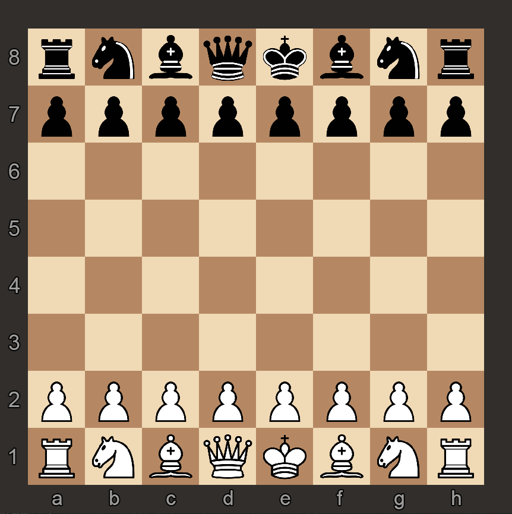
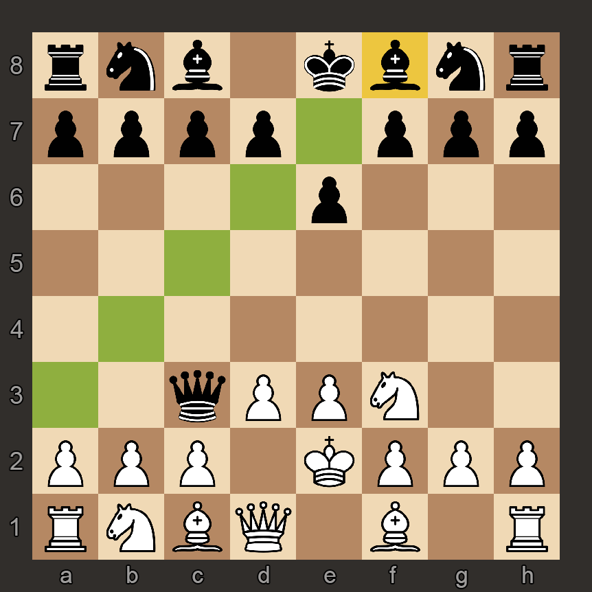
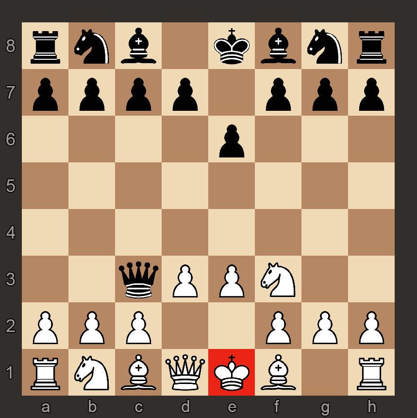

# Chess
A didactic GUI chess game made in Python3 using pygame.  
At the moment, there is no AI. The only way you can test the game is by playing against another human.

## No commits?
When I started coding this project in January I didn't set a repository up (I don't know why).  
So, I just uploaded the folder I have on my PC.

## Screenshots

## TODO list:
- Implement the [FEN](https://www.wikiwand.com/en/Forsyth%E2%80%93Edwards_Notation);
- Change the colors;
- provide a setup.py script;
- I didn't test it on Linux / MacOS;
- Maybe add a neural network?
